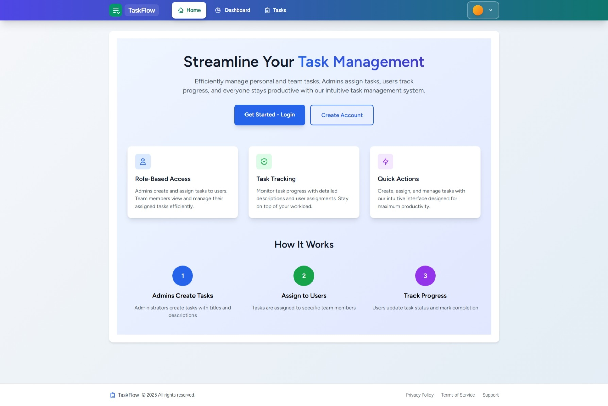
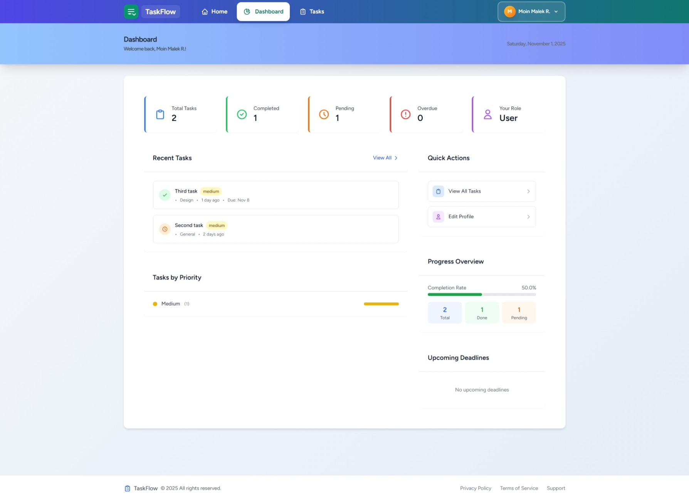
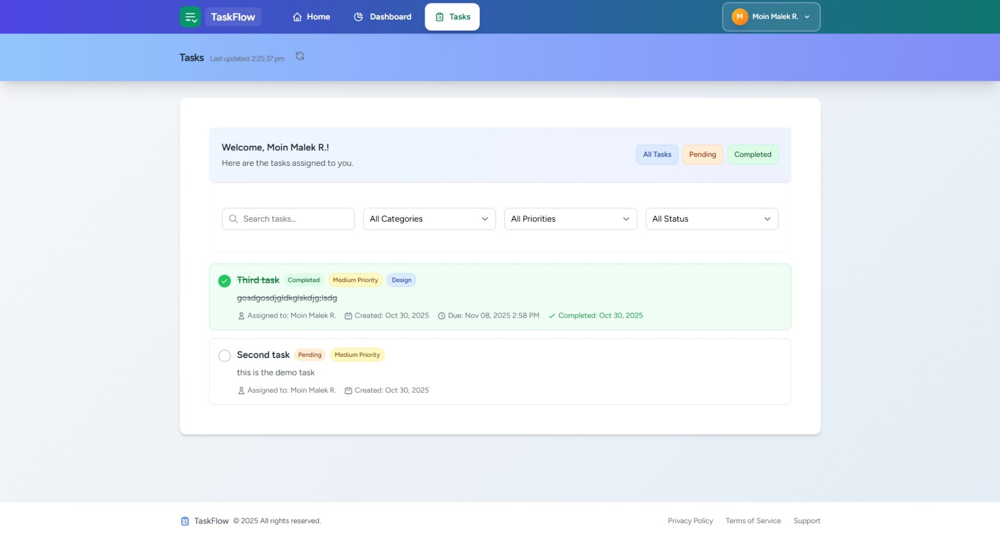
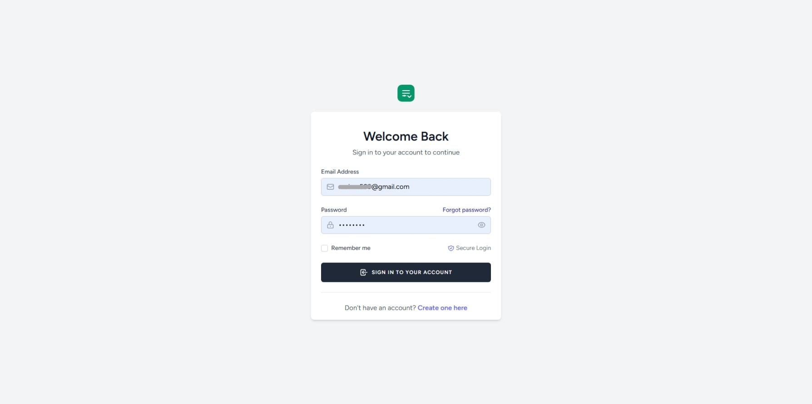
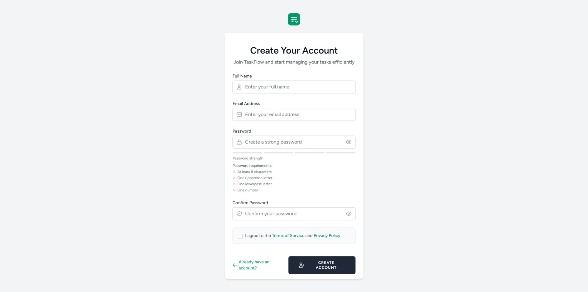

# Task Manager Laravel

Efficiently manage personal and team tasks. Admins assign tasks, users track progress, and everyone stays productive with our intuitive task management system.

## Table of Contents

- [Features](#features)
- [Demo](#demo)
- [Screenshots](#screenshots)
- [Getting Started](#getting-started)
- [Database Schema](#database-schema)
- [Usage](#usage)
- [Roadmap & Improvements](#roadmap--improvements)
- [Contributing](#contributing)
- [License](#license)

---

## Features

- **Role-Based Access**
  - Admins can create, assign, and manage tasks for users.
  - Users can view assigned tasks and mark them as done/pending.

- **Task Tracking**
  - View and update task status.
  - Track progress for each assigned user.

- **Quick Actions**
  - Create, assign, and manage tasks with an intuitive interface.

---

## Demo

[Live Demo](https://task-manager-laravel-xuai.onrender.com)

---

## Screenshots

---

## Getting Started

### Prerequisites

- Docker (recommended)
- Node.js & NPM
- Composer
- PostgreSQL

### Installation

1. **Clone the repository**

2. **Install PHP dependencies**

3. **Install JavaScript dependencies**

4. **Build frontend assets**

5. **Configure environment variables**
- Copy `.env.example` to `.env` and set your database, mail, and APP_URL settings.

6. **Run migrations**

7. **Start server**
- For local: `php artisan serve`
- For Docker: refer to the Dockerfile

---

## Database Schema

### Users

| Field             | Type             | Notes                       |
|-------------------|------------------|-----------------------------|
| id                | bigint           | Primary key                 |
| name              | string           |                             |
| email             | string           | Unique, required            |
| email_verified_at | timestamp        | Nullable                    |
| password          | string           | Hashed                      |
| remember_token    | string(100)      | Nullable                    |
| role              | string           | Default `'user'`            |

### Tasks

| Field        | Type      | Notes                       |
| ------------ | --------- | --------------------------- |
| id           | bigint    | Primary key                 |
| title        | string    | Required                    |
| description  | text      | Nullable                    |
| user_id      | bigint    | Foreign key (assigned user) |
| completed    | boolean   | Defaultfalse                |
| category     | string    | Default `'general'`           |
| priority     | string    | Default `'medium'`            |
| due_date     | timestamp | Nullable                    |
| completed_at | timestamp | Nullable                    |

---

## Usage

- **Admins** can log in, create tasks, assign them to users, and update/delete any task.
- **Users** can view their tasks and mark each as done or pending via a simple UI.

---

## Roadmap & Improvements

- [ ] Assign tasks to multiple users
- [ ] Add task priorities and due dates
- [ ] Notifications for task updates and deadlines
- [ ] Activity log for task history
- [ ] Task comments and file attachments
- [ ] Dashboard filters, search, and analytics
- [ ] Role-based permissions (e.g., managers)

---

## Contributing

Contributions welcome! See [CONTRIBUTING.md](CONTRIBUTING.md) for more info.

---

## License

Distributed under the MIT License. See `LICENSE` for more information.

---

## Credits

Built with [Laravel](https://laravel.com/) and [PostgreSQL](https://www.postgresql.org/).
